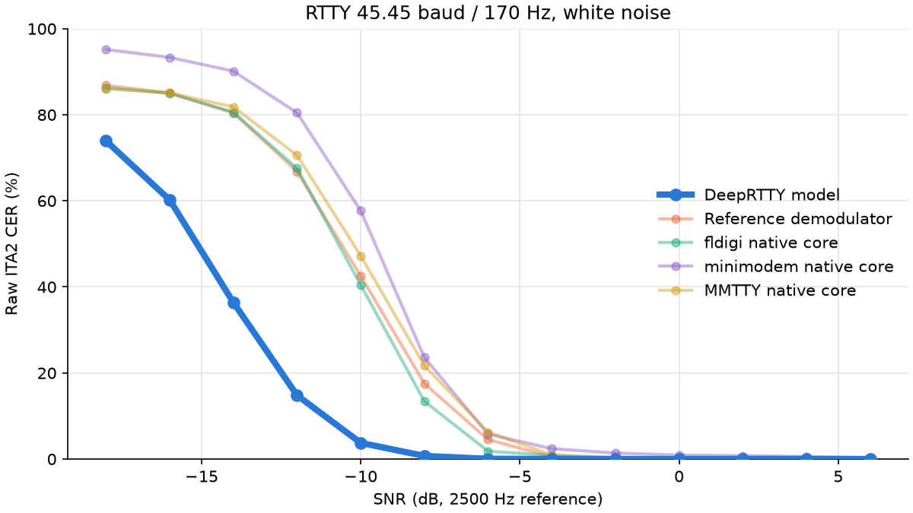

# DeepRTTY - a ML-based decoder for amateur-radio RTTY mode

DeepRTTY is a ML-based decoder for amateur-radio RTTY mode. This repository contains the inference model, minimal Python and Node.js implementations, and a reproducible comparison with conventional RTTY demodulators.

DEMO (Integrated into DeepCW; can be enabled in Settings.): https://deepcw.cc/

## Receiving audio

The wanted RTTY signal must already be centered at 800 Hz, 45.45-baud, 170 Hz-shift FSK. Pipe mono 3,200 samples/s s16le PCM to the Python or Node.js stream receiver:

```bash
cd examples/python
ffmpeg -i input.wav -ac 1 -ar 3200 -f s16le - | python rtty_stream.py
```

or

```bash
cd examples/nodejs
ffmpeg -i input.wav -ac 1 -ar 3200 -f s16le - | node rtty_stream.mjs
```

## Benchmark

The default comparison builds pinned upstream receiver cores with headless audio and raw-code adapters. Python handles signal generation, sample-rate conversion, and scoring. These are receiver-core measurements; GUI applications and audio device handling are excluded.

All receivers process the same deterministic 30-second signals.
The test uses centered 45.45-baud/170 Hz RTTY macros in white noise, with SNR referenced to a 2,500 Hz noise bandwidth.

| Raw ITA2 CER | DeepRTTY | fldigi C++ | minimodem C | MMTTY C++ |
| --- | ---: | ---: | ---: | ---: |
| 10% | -11.13 dB | -7.41 dB | -6.47 dB | -6.49 dB |
| 5% | -10.22 dB | -6.55 dB | -5.53 dB | -5.53 dB |

At 10% CER, DeepRTTY gained approximately 3.7 dB over fldigi, 4.7 dB over
minimodem, and 4.6 dB over MMTTY under these conditions.

```bash
cd benchmarks
python3 -m venv .venv
source .venv/bin/activate
python -m pip install -r requirements.txt
python src/build.py --bootstrap-fftw
python run_benchmark.py
```



## License

AGPL-3.0-only. See [LICENSE](LICENSE). The benchmark upstream sources
retain their licensing notices; see [THIRD_PARTY_NOTICES.md](benchmarks/THIRD_PARTY_NOTICES.md).
